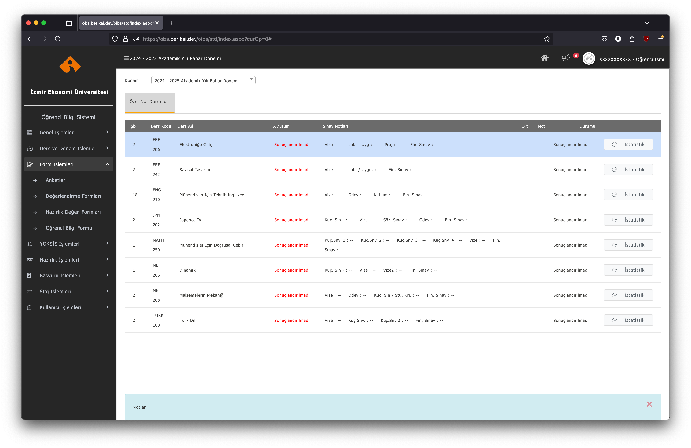

# 💅 Proliz Beautifier

Proliz Beautifier (Proliz Güzelleştirici), 🇹🇷 Türkiye'deki üniversiteler arasında yaygın olarak kullanılan bir öğrenci bilgi sistemi olan Proliz için bir kullanıcı arayüzü iyileştirmesidir. Bu proje ile Proliz platformunun görsel ve kullanışsal çekiciliğini arttırarak öğrenci ve akademisyenler için daha modern ve sezgisel bir deneyim sağlanması hedeflenmektedir.

Vekil sunucu aracılığıyla kullanmak için [buraya tıkla](https://obs.berikai.dev)!

Kullanıcı betiği indirerek kullanmak için [buraya tıkla](https://github.com/Berikai/proliz-beautifier/raw/refs/heads/main/src/userscript/proliz-beautifier.user.js)!
 
<details>

<summary>🇬🇧 English</summary>

Proliz Beautifier is a user interface enhancement for Proliz, a popular student information system widely used across universities in 🇹🇷 Türkiye. This project aims to improve the visual appeal and usability of the Proliz platform, providing students and administrators with a more modern and intuitive experience.

[Click here](https://obs.berikai.dev) to use it through a proxy!

[Click here](https://github.com/Berikai/proliz-beautifier/raw/refs/heads/main/src/userscript/proliz-beautifier.user.js) to use it by downloading the userscript!

</details>

<details>

<summary>📷 Ekran görüntüsü</summary>



</details>

## ⚙️ Yaklaşım

Proliz platformunun görünümüne etki eden ana CSS sınıfları ağırlıklı olarak `App_Themes/oibs18/oibs18.css` dizininde bulunan dosya tarafından sağlanıyor. Bu CSS dosyasının sonuna mevcut sınıfları "overwrite" edecek şekilde sınıfları yeniden tanımlayarak düzenlemeler yapmak, görsel manipülasyonumuzu yapmak için yeterli oluyor.

İlgili CSS eklemelerini repoda bulunan [./src/css/oibs18.css](./src/css/oibs18.css) dosyasına ekledim. 

Bu bağlamda geriye website içeriğini manipüle etmek kaldı. Bunun için iki farklı yol izledim.

- Proxy (vekil sunucu): Yerel olarak Proliz Beautifier vekil sunucusunu çalıştırarak veya halihazırda herkese açık bir şekilde çalışan [bu vekil sunucu](https://obs.berikai.dev) üzerinden kullanılabilir.

- Userscript (kullanıcı betiği): Tarayıcıya kurulan bir kullanıcı betiği yöneticisi eklentisine [Proliz Beautifier betiği](./src/userscript/proliz-beautifier.user.js)ni ekleyerek kullanılabilir. (örn. Tampermonkey)

## 💻 Vekil sunucuyu yerelde çalıştırmak

> Güncel bir NodeJS sürümü gereklidir.

1. Repoyu klonla:
    ```bash
    git clone https://github.com/berikai/proliz-beautifier
    ```
2. Proje dizinine git:
    ```bash
    cd proliz-beautifier
    ```
3. Gerekli bağımlılıkları kur:
    ```bash
    npm install
    ```
4. Uygulamayı başlat:
    ```bash
    npm start
    ```

## ✅ Yapılacaklar

- [ ] Kullanıcı betiği, CSS eklentisini bu repodan çekerek uygulayacak şekilde ayarlanacak.

- [ ] Aşağıda listelenen sistemlere proxy ile bağlanırken yaşanan problemler düzeltilecek. O zamana kadar üniversite seçim ekranından çıkarıldılar.

    - [ ] obs.yildiz.edu.tr: `Proxy Error: Error: write EPROTO 804CF70502000000:error:0A000152:SSL routines:final_renegotiate:unsafe legacy renegotiation disabled:ssl/statem/extensions.c:948`
        - Sebep: İlgili sunucu 'RFC5746 secure renegotiation' desteklemiyor.

    - [ ] obs.beu.edu.tr: `Proxy Error: Error: unable to verify the first certificate`
        - Sebep: İlgili sunucu istemciye tüm SSL sertifika zincirini sağlamıyor.
    
    - [ ] obs.firat.edu.tr: `Proxy Error: Error: unable to verify the first certificate`
        - Sebep: İlgili sunucu istemciye tüm SSL sertifika zincirini sağlamıyor.

    - [ ] obs.yasar.edu.tr: `Cloudflare: Web sitesine bu adresten erişilemiyor.`
        - Sebep: İlgili sunucunu kullandığı ters vekil sunucu, Cloudflare, erişime izin vermiyor.

## 🤝 Katkı

Projeye katkıları memnuniyetle karşılıyorum! İlgili katkılarınız için pull request gönderebilirsiniz 🤗

## 📜 Lisans

Bu proje [MIT Lisansı](LICENSE) ile lisanslanmıştır.